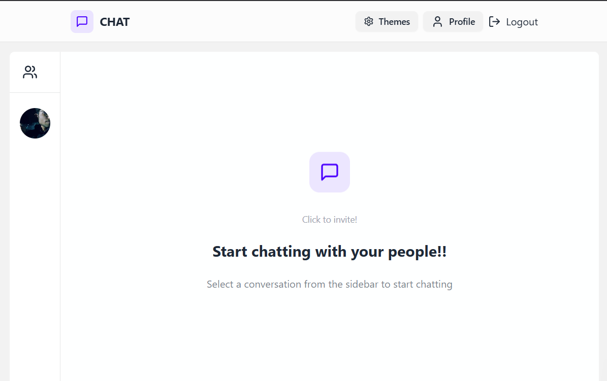

# 💬 Real-Time Chat Application

A full-stack **Real-Time Chat App** built with the MERN stack and Socket.io, focused on low-latency messaging, secure authentication, and a modern multi-theme UI.

🌐 Live Demo: [Link to chatty!](https://message-app-iota.vercel.app/login)

---

## ✨ Features

- ⚡ Real-time messaging using **Socket.io** (low latency)
- 🔐 Secure user authentication
- 🎨 Fully responsive UI with **Tailwind CSS**
- 🌈 Multi-theme support using **DaisyUI**
- 🧠 State management with **Zustand**
- 🔁 API communication using **Axios**
- 🧩 Modern UI icons with **Lucide-React**

---

## 🛠 Tech Stack

- **Frontend:** React.js, Tailwind CSS, DaisyUI, Zustand, Axios, Lucide-React  
- **Backend:** Node.js, Express.js, MongoDB  
- **Real-time:** Socket.io  
- **Deployment:** (Add if deployed)

---

## 🖼 Screenshots

### 🔐 Login Page

  
   
  

### 💬 Main Chat Page

  
   
  

---

## ⚙️ Running Locally

This repository contains **two folders**: `client` and `server`.  
You need to run both **manually**.

### 1️⃣ Clone the repository

git clone <your-repo-url>

cd <your-repo-name>

### 2️⃣ Run the Backend

cd server

npm install

npm run start

### 3️⃣ Run the Frontend

cd client

npm install

npm run dev
